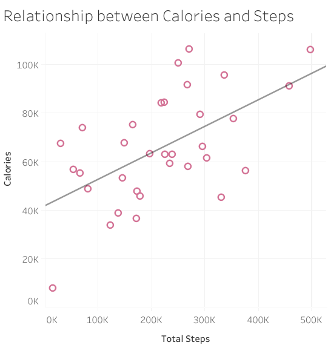
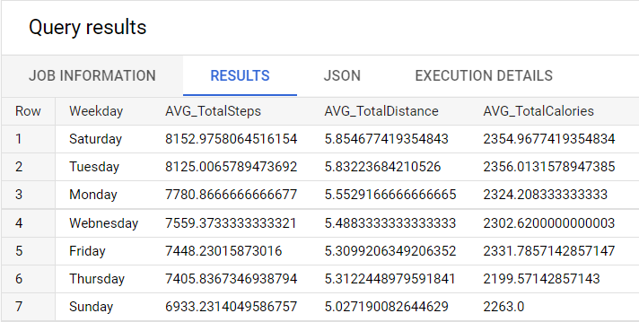
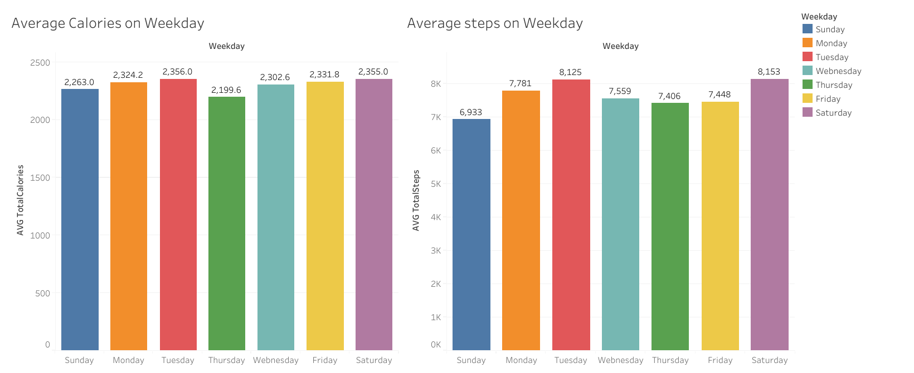
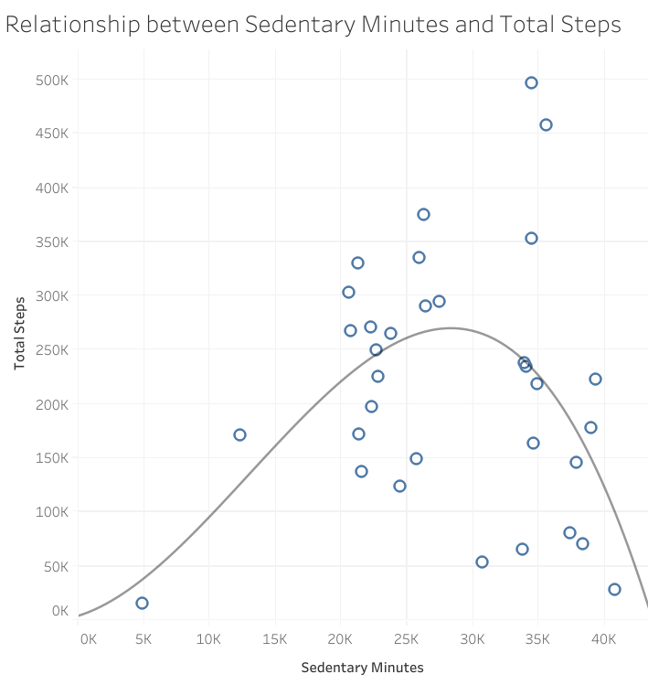
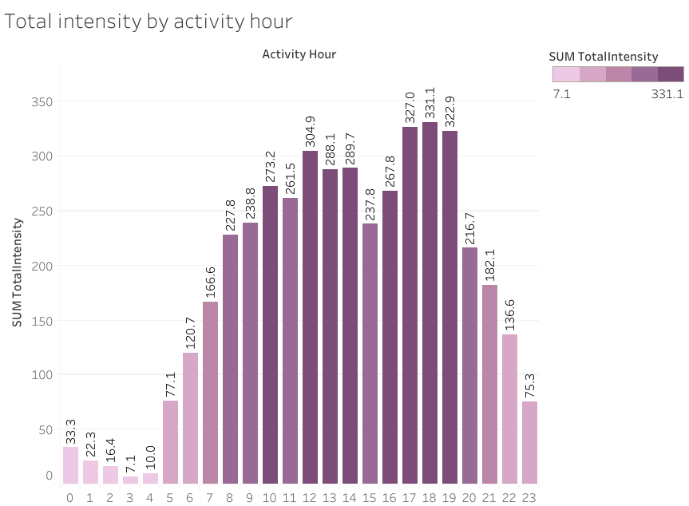

It is first important to understand the <a href="https://bellabeat.com/" target="_blank">Bellabeat</a> company's goals and services they offer before we can begin the analysis.

## 1. Company Summary

According to Forbes, “Bellabeat is a data-oriented wellness tech company that was founded by Sandro Mur, Urška Sršen, and Lovepreet Singh in 2013” (Robter, 2020). The company is global with offices in London, Hong Kong and Zagreb, but is headquarter in San Francisco. The company focuses on women's health and wellness with a collection of wearable and non-wearable tech. The four pillars of their brand include: smart insights, women-centric, holistic approach and body positivity. With this in mind, their products focus on including metrics around a woman's menstrual cycle stating on their website that “Bellabeat helps you get in sync with your natural cycle” and that “through tracking your body's bio-responses and aligning that data with your hormonal cycle, you'll always know why you feel how you do.”

### Company products

The company's wearable products include:

1. **Ivy** - “A health tracker disguised as smart jewelry”
2. **Time** - “An elegant hybrid wellness watch”
3. **Leaf** - Available in three styles: chakra, urban, & crystal and can be worn as a necklace, bracelet or clip. This was Bellabeat's classic wellness tracker.
4. **Spring** - A “smart water bottle” designed to track your drinking / hydration habits.

All of the company's wearables sync to their Bellabeat app where members can check their metrics. The wearables track activity (steps taken, distanced traveled, calories burned and activity minutes) & sleep and through the app you can also track your menstrual cycle, hydration (if not using Spring) & meditation. Their IVY wearable also tracks heart rate metrics.

Bellabeat also offers a Wellness Coach app with “unlimited access to 400+ education video, written, and audio content from areas of beauty, fitness, mindfulness, women's health and more” through their **Bellabeat+** membership.

## 2. ASK Phase

### Business Task

Utilizing the Fitbit Fitness Tracker Data, identify some trends in smart device usage, how these trends can be applied to Bellabeat's customers and how they can help influence Bellabeat's marketing strategy.

### Stakeholders

1. **Urška Sršen** - Bellabeat's cofounder and Chief Creative Officer
2. **Sando Mur** - Mathematician and Bellabeat's cofounder
3. **Bellabeat's marketing analytics team** - a team of data analytics

## 3. PREPARE Phase

### Data Used

The data source used for this case study is <a href="https://www.kaggle.com/datasets/arashnic/fitbit" type="_blank">FitBit Fitness Tracker Data</a>. This dataset was downloaded from Kaggle where it was uploaded by Möbius.

### Accessibility & Usage of Data

The dataset was published by Möbius to Kaggle.com under the CC0: Public Domain Creative Common License - waiving all rights to the work and allowing for the dataset to be copies, modified, distributed and performed without asking for permission. Möbius cited the dataset from Zendo: Furberg, Robert; Brinton, Julia; Keating, Michael ; Ortiz, Alexa <a href="https://zenodo.org/record/53894#.YMoUpnVKiP9" type="_blank">[Source Here]</a>.

### Data Summary

According to the dataset information submitted on Zenodo.org, "this dataset was generated by respondents to a distributed survey via Amazon Mechanical Turk between 03.12.2016 - 05.12.2016.Thirty eligible Fitbit users consented to the submission of personal tracker data, including minute-level output for physical activity, heart rate, and sleep monitoring." Additionally, "Variation between output represents use of different types of Fitbit trackers and individual tracking behaviors / preferences."

### Data Organization

Eighteen datasets were downloaded from the **FitBit Fitness Tracker Data**. The datasets downloaded in .csv file format and included long and wide formats. The datasets chosen for analysis below included a user count of 33 participants over a 31 day period of time.

### Data Limitations & Integrity

The **FitBit Fitness Tracker Data** was collected in 2016 making the datasets outdated for current trend analysis. Additionally, while the data initially states a time range of 03-12-2016 to 05-12-2016, after data verification, the data collected was only during a 31 day period (04-12-2016 to 05-12-2016). Since the data only included instances over a 31 day period, the timeframe for a more insightful analysis is realitively small.

Lastly, the sample size itself could create a sample bias. While a sample size of 30 _(our data later shows a sample size of 33)_ will hold up within the CLT theorm, a larger sample size will be more representative of the population and would increase the confidence interval. Additionally, since there were no demographic information collected it will be hard to see if we have a true representation of a national or global population. This lack of demographic information will also limit recommendations on the target audience (including gender, location, age and job status) and where to market to them. Considering that Bellabeat is primarily targeted to women and individuals who menstruate, having demographics would have bolstered any recommendations after analysis.

## 4. PROCESS Phrase

### Datasets Selected

For the casestudy analysis the following datasets were chosen:

- Daily_Activity
- Daily_Sleep
- Hourly_Steps
- Hourly_Intensities
- Hourly_Calories
- Weight_Log_Info
- Heart_Rate

### Using Excel to Clean Data

Each dataset was cleaned using Excel. The following steps were taken within each dataset:

- Sorted and filtered data by Id to obtain how many unique users there were within the dataset.
- Checked for duplicate data using the 'duplicate data' tool in Excel
- Formatted date data into MM/DD/YY date format
- Formatted all numerical data into Number format with either no decimils or up to 2 decimials.
- Sorted by date to find the first and last date of the dataset (this is what first indicated only a 31-day period of activity was captured).
- Separated Date and Hour into two columns when needed for later analysis. Utilized the 'Text to Columns' tool to do so.
- Formatted any time data into 00:00:00 format for consistency.
- Checked Id entries and other columns for LEN to make sure the data was correct and uniform in length

After the cleaning process was finished, only 3 rows of duplicate information was found within the Daily_Sleep_Merged file. These were removed before analysis.

### Next steps

After cleaning the data, I decided to work with SQL to analyze the information versus staying in Excel (although I did go back a few times for visualizations). Why SQL? SQL and Excel are the two biggest skills being requested (& used) within a Data Analysts' job. So I'm hoping to showcase that skillset here.

With that said, Excel and R would have worked for anaylsis as well. <a href="https://www.kaggle.com/code/chebotinaa/bellabeat-case-study-with-r" type="_blank">ANASTASIIA CHEBOTINA</a> have good examples of analyzing this data with R.

## 5. ANALYZE & SHARE Phases

### SQL Dataset Upload.

Uploaded FitBit Fitness Tracker Data into BigQuery

### User Verification: Exploring the number of users in each dataset.

Checked for # of participants by counting number of distinct Ids in each dataset

```sql
#SELECT COUNT (DISTINCT Id) AS Total_Ids
#FROM `quick-howl-355111.Bellabeat.Daily_Activity`

#SELECT COUNT (DISTINCT Id) AS Total_Ids
#FROM `quick-howl-355111.Bellabeat.Day_Sleep`

#SELECT COUNT (DISTINCT Id) AS Total_Ids
#FROM `quick-howl-355111.Bellabeat.Hourly_Calories`

#SELECT COUNT (DISTINCT Id) AS Total_Ids
#FROM `quick-howl-355111.Bellabeat.Hourly_Intensities`

#SELECT COUNT (DISTINCT Id) AS Total_Ids
#FROM `quick-howl-355111.Bellabeat.Hourly_Steps`

SELECT COUNT (DISTINCT Id) AS Total_Ids
FROM `quick-howl-355111.Bellabeat.Weight_Log_Info
```

I repeated the SQL query above with each dataset (changing the FROM clause each time) and received these results.

- Daily_Activity = 33
- Day_Sleep = 24
- Hourly_Calories = 33
- Hourly_Intensities = 33
- Hourly_Steps = 33
- Weight_Log_Info = 8

`Heart_Rate` data is a bit more special. Since it's a large dataset with more than 2 million rows and I cannot change the datetime type into date by using Excel, I imported the table with skemma for each row as STRING type. This step allowed me to import the table into SQL successfully, however, the row of the title was automatically doubled and all the dataset was saved under STRING type.Thus, I performed the following steps to change the data type:

```sql
# Change dataset type:
SELECT
  CAST(Id AS FLOAT64) AS New_Id,
  LEFT(Time,9) AS date,
  CAST(Value AS FLOAT64) AS New_Value
FROM
  `quick-howl-355111.Bellabeat.Heart_Rate`
where
  Id <> "Id"
```

I then exported the result and named it as `Heart_Rate_Cleaned`. Now, I can start to analyze the `Heart_Rate_Cleaned` dataset to see many how many users that the heartrate data consists of.

```sql
#Count number of users in Fitbit heartrate dataset:
SELECT
      COUNT(DISTINCT New_Id) AS Num_of_Id
FROM `quick-howl-355111.Bellabeat.Heart_Rate_Cleaned`
```

- Heart_Rate_Cleaned = 14

From above analysis: it is seen that more users prefer to use the daily Activity feature to track their wellness habit than other features such as sleep, heartrate or weight. The second most popular feature is sleep, the third popular one is heartrate, followed by weight.

Both the Heart Rate and Weight Log datasets do not include enough data to move forward with analysis. These datasets will not be used.

### Examine the relationship between total calories and total steps.

To examine the relationship between total calories and total steps, I used tableau.



Results shows that total steps and calories have a positive correlation, which is obvious - the higher calories user consume, the higher total steps that users walk or run.

### Examine which day users are most active in walking and which day users are least active in walking.

I also examined which day users consumed highest calories and which day users consumed lowest calories. To do this, I used Excel to change the activity date into weekday by using text formula. After that, using SQL, I could answer the question which weekday users had the highest average number of steps and highest average distance.

The result shows that Saturday is the day that users are most active walking, followed by Tuesday. The result also indicates that Saturday and Tuesday are also the days that users have the highest calories on average, meanwhile, on average, Sunday is typically not the day that users are active in walking.

```sql
SELECT
 DISTINCT Weekday,
 AVG(TotalSteps) AS AVG_TotalSteps,
 AVG(TotalDistance) AS AVG_TotalDistance,
 AVG(Calories) AS AVG_TotalCalories
FROM
 `quick-howl-355111.Bellabeat.Weekday_Daily_Activity`
GROUP BY
 Weekday
ORDER BY
 AVG_TotalSteps DESC
```

Result:


Visualization, created using Tableau:


### Examine the question if higher sedentary (sitting) time will lead to lower number of steps.



Sedentary Minutes and TotalSteps does not have a linear relationship. But it can be observed that number of steps will increase when sedentary minutes are from 0-500 mins, and number of steps will reduce when sedentary minutes are from 1000-1500. This is interesting, because we can recommend users who have sedentary time more than 1000 minutes should start exercising more.

### Examine what time the users are most active.

I used hourlyIntensities data to answer this question. First, to easily input in SQL, I opened this file in Excel and split ActivityHour data that combines both Day and Time to get only ActivityHour which was not including the date, month and year. Then, I input the data into SQL and coded as below:

```sql
SELECT
 Time,
 SUM(AverageIntensity) AS SUM_TotalIntensity
FROM `quick-howl-355111.Bellabeat.Houly_Intensities_Update`
GROUP BY Time
```

Result: <a href="https://drive.google.com/file/d/1ldGH3duUEYAqkBSKNzbAq3s23wypMZAS/view?usp=sharing" type="\_blank">Table</a> generated according to intensity by activity hour.

Visualization: 

It can be seen that users are most active from 17-19h (evening), which indicates that users will often exercise during this period of time.

## Conclusion

Bellabeat's women-centric, holistic approach paired with smart insights and body positivity has led to the creation of wearable technology for women. These products empower women to utilize data to improve their overall health.

Since Bellabeat focuses strongly on a female audience for their products, I would recommend that the company look into using their own marketing and user data or conduct their own data collection to gain further insights and trends. I'd also recommend using a larger sample size if possible in order to increae the confidence interval. Since the data utilized in this case study did not include demographic information, I'm unable to give a more detailed recommendaion or ensure there was no sampling bias.

With that said, I was able to see some trends in the FitBit Fittness Tracker Data utilized in this case study.

### Below is the summary of my findings and recommendation:

1. More users prefer to use daily Activity feature to track their wellness habit than other features such as sleep, heartrate or weight. The second most popular feature is sleep, the third popular one is heartrate, followed by weight. This information can be used in featuring Bellabeat products.
2. Saturday is the day that users are most active in walking or running, followed by Tuesday. These 2 days are also the days that users consume the highest calories in the entire week.
3. Calories and Steps have a positive linear relationship. When users run or walk more often, they will also consume more calories.
4. Sedentary Minutes and TotalSteps does not have a linear relationship. But it can be observed that number of steps will increase when sedentary minutes are from 0-500 mins, and number of steps will reduce when sedentary minutes are from 1000-1500. This is interesting, because we can recommend users who have sedentary time more than 1000 minutes should start exercising more.
5. It can be seen that users are most active from 17-19h, which indicates that users will often exercise during this period of time. In Bellabeat app, we can recommend users to practice exercise during this period of time. The data can actually be adjusted to each user data and we can advise excerse time for each user.
6. It would be better if this Fitbit dataset contains more demographic information of users such as their gender. Fitbit also does not have information about user hydration level, so Bellabeat can incorporate this information into their product and provide suggestions regarding suitable hydration level to its users.

### Marketing Recommendations

Again, while there were no demographic information to assist with any potential marketing recommendations there were some insights that might be helpful for the marketing team:

1. The data showed that 93.5% of users were 'active users' meaning that they utilized their FitBit consistently for 25 - 31 days throughout the data collection time frame. This high level of activity indicates that this group of users are invested in utilizing their fitness tracker. **I would recommend marketing Bellabeats products to customers who may already own a tracker or are already invested in wellness or learning about their health.** Showcasing this product as woman - focused as its unique features may convience customers who already own a wearable to switch to one of Bellabeat's products for the benefit of more targeted insights.

2. The data also showed (as mentioned above) that the total steps tracked were highest during the lunch time frame and the 5pm - 7pm time frame. This indicates that most users have a set routine - usually fitting in the most activity during lunch or potentially after work.**I'd recommend that Bellabeat market their products to customers most likely living around this particular type of routine - customers with a set job schedule and parents with a set daily routine.**
