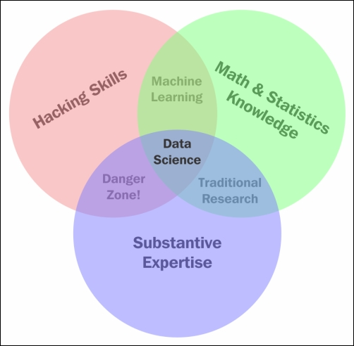

The important thing to remember is that math really forms the foundation of what we're going to do. If you see the Data Science Venn Diagram, we've got maths and stats in the right corner.

But for beginners or students, who started their Data Science learning journey. The most important question is how much math is enough? Or to put it another way, why do
you need math at all, because you have got a computer to do it?

Well, I can think of three reasons why you don't want to rely on just a computer and it's helphul to have some sound mathematical understanding.

Here they are:

1. You need to know which procedures to use & why. 🤔

2. You need know what to do when things don't work right. Sometimes you get impossible results. And it is good to know
   the mathematics that go into calculating that, so that you can understand how something apparently impossilbe can work.
   It helps to understand what it is about the algorithm that's happening, and why that won't work in that situation.

3. Interestingly, sometimes for some procedures, some math is easier and quicker to do by hand than by firing up the computer. 🤷‍♂️

Now, fundamentally there is a nice sort of analogy here.

> _Math is to data science as, for instance, chemistry is to cooking, kinesiology is to dancing, and grammer is to writting._

The idea here is that you can be wonderful cook with knowing any chemistry, but if you know some chemistry it is going to help. You can be wonderfull dancer without
knowing kinesiology, but it is going to help. And you can probably be a good writer without having an explicit knowledge of grammer, but it is going to make a big difference if you know some.

The same thing is true for data science, you will do it better if you have some of the foundational information.

So, the next question is. 👇

## What kinds of math do you need for Data Science?

Well, there's few answers to that.

1. You need some elementary algebra. You have to do some linear or matrix algebra because that it is the foundation of a lot of the calculations.
   And also linear equations where you are trying to solve several equations all at once.
2. Some Calculus.
3. Big O, which has to do with the order of a function, which has to do with sort of how fast it works.
4. Probability is important.
5. Baye's theorem, which is a way of getting what is called a posterior probability, can be a helpful tool for answering some fundamental questions in data science.

So in sum, a little bit of math can help you make informed choices when planning your analyses. It can help you find the problems and fix them when things aren't going right.

It is the ability to look under the hood that makes a difference.😎

And then truthfully, some mathematical procedures, like systems of linear equations, that can even be done by hand, sometimes faster than what you can do with a computer.

So, you can save yourself some time and some effort and move
ahead more quickly toward your goal of insight.

I believe this gave you some clarification and answered your question, why and how maths makes a difference in data science?

And also check out my article on [Why Statistics Matter in your Life!](https://www.varunsrivatsa.dev/blog/statistics/why_stats_matter/)

---
