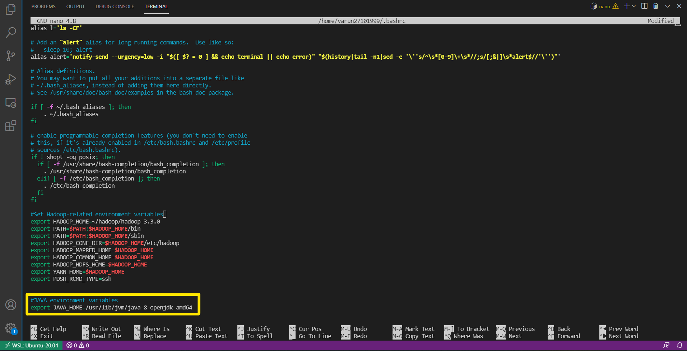
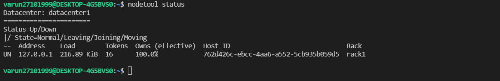

Windows support was removed for the latest release candidate for apache Cassandra 4.0. (May change in future)
So, if you need to run Cassandra on windows you have two options:

- You can download apache cassandra 3.x and run it natively on windows
- You can use WSL to run Cassandra 4.0

In this article I'll be showing how to install latest Cassandra 4.0 in windows using WSL.

### Why you should consider Cassandra 4.x over 3.x?

1. Firstly, Cassandra 4.0 supports Java 11 and uses the latest version of python 3 or python 2.7 (support deprecated).
2. Various innovations and enhancements is Cassandra 4.0 have resulted in improved performance and reduced costs.
3. Cassandra 4.0 has increased the number of requests it can process per second by 25% to 70% while reducing the "tail latency" for those requests by a factor of 7; and with the addition of backpressure management, applications can now verifiably achieve peak performance.
4. These improvements are complemented by enhancements to the compaction and repair maintenance process that reduce memory, disk IO, and CPU usage dramatically, resulting in greater system stability.
5. Put all these improvements together and Cassandra 4.0 is faster and cheaper to operate than any previous version.

### Prerequisites

- Install the latest version of Java 8, either the [Oracle Java Standard Edition 8](http://www.oracle.com/technetwork/java/javase/downloads/index.html) or [OpenJDK 8](http://openjdk.java.net/). To verify that you have the correct version of java installed, type `java -version`.
- **NOTE:** _Experimental_ support for Java 11 was added in Cassandra 4.0.
  [(CASSANDRA-9608)](https://issues.apache.org/jira/browse/CASSANDRA-9608). Running Cassandra on Java 11 is _experimental_. Do as at your own risk. For information, see [NEWS.txt](https://github.com/apache/cassandra/blob/trunk/NEWS.txt).
- For using cqlsh, the latest version of [Python 3.6+](https://www.python.org/downloads/) or Python 2.7 (support deprecated). To verify that you have the correct version of Python installed, type `python3 --version`.

#### Install WSL (Windows Subsystem for Linux)

Follow the steps mentioned on the page below to first enable Windows Subsystem for Linux and then install a Linux distribution of your choice.
[Windows Subsystem for Linux(WSL) installation Guide for Windows 10](https://docs.microsoft.com/en-us/windows/wsl/install-win10#manual-installation-steps)

#### Install Java OpenJDK

After completing the WSL installation, start your Linx distro and install Java JDK using terminal. First update the package index:

```shell
sudo apt update
```

Check whether Java is already installed: `java -version`.
If Java isn't installed, install Java 8 from OpenJDK via the following command: `sudo apt-get install openjdk-8-jdk`. Check the version installed again `java -version`.

```shell
java -version
openjdk version "1.8.0_275"
OpenJDK Runtime Environment (build 1.8.0_275-8u275-b01-0ubuntu1~20.04-b01)
OpenJDK 64-Bit Server VM (build 25.275-b01, mixed mode)
```

#### Setup environment variables

```shell
nano ~/.bashrc
```

Setup Java environment variables at the end of the `.bashrc` file as shown in the following image & then save the bash file and close it.

```shell
export JAVA_HOME=/usr/lib/jvm/java-8-openjdk-amd64
```

Java installation path may vary sometimes, so navigate to the above mention path and make sure you find java-8-openjdk-amd64 file in the directory.



To check, whether its working or not, run the following command in your terminal.

```shell
echo $JAVA_HOME
```

It should display the path you saved earlier in `.bashrc` file.

```shell
/usr/lib/jvm/java-8-openjdk-amd64
```

#### Python

Python3 should be already installed in most of the Linux distro.
Just to make sure type the following command in the terminal: `python3 --version`.

That should display the python version installed in your computer, else type `sudo apt install python3` to install python in your computer.

#### Next install Curl package

Type `sudo apt install curl`.

Then type your password and when it prompts "do you want to continue?", type yes
. That should install curl.

### Let's install Cassandra 4 now.

There are three ways to install Cassandra in Linux.

1. Installing the binary tarball
2. Installing from Debian packages
3. Installing from RPM packages

_**Note:** Above mentioned instructions are mandatory for all Cassandra installation methods._

As of now, I'll be using 2nd method. Installing from Debian packages. If you want to know more about this installation methods. Follow the link mentioned below.

[Cassandra Installation Methods](https://cassandra.apache.org/doc/latest/getting_started/installing.html)

#### Installing the Debian Packages

1. In your terminal, copy and paste the following command

```shell
echo "deb http://downloads.apache.org/cassandra/debian 40x main" | sudo tee -a /etc/apt/sources.list.d/cassandra.sources.list
```

When you press enter, below mentioned message should display.

```shell
deb http://downloads.apache.org/cassandra/debian 40x main
```

That will add the Apache repository of latest major version of Cassandra 4 to the file cassandra.sources.list.

2. Add the Apache Cassandra repository keys to the list of trusted keys on the server:

```shell
curl https://downloads.apache.org/cassandra/KEYS | sudo apt-key add -
```

Your will find following output.

```shell
  % Total    % Received % Xferd  Average Speed   Time    Time     Time  Current
                                 Dload  Upload   Total   Spent    Left  Speed
100  266k  100  266k    0     0   320k      0 --:--:-- --:--:-- --:--:--  320k
OK
```

3. Update the package index from sources

```shell
sudo apt-get update
```

4. Then install Cassandra with APT:

```shell
sudo apt-get install cassandra
```

_**Note:** A new Linux user Cassandra will get created as part of the installation. The Cassandra service will also be run as this user._

#### After installation completes, we can run cassandra.

To start Cassandra, run

```shell
sudo service cassandra start
```

Wait for some time and you can check the status of Cassandra by running

```shell
sudo service cassandra status
```


Then you can check the health of your node cluster by running

```shell
nodetool status
```



You can also open cassandra query language shell a.k.a ( cqlsh ) by typing `cqlsh`.


_**Note:** cqlsh requires python to run, make sure you have installed it if the above mentioned command throws an error.\*_

And you can stop the Cassandra service by running

```shell
sudo service cassandra stop
```

---

This ends Cassandra installation in windows using WSL. Hope you were able to follow along. Leave a comment below if you have any issues or complain.
