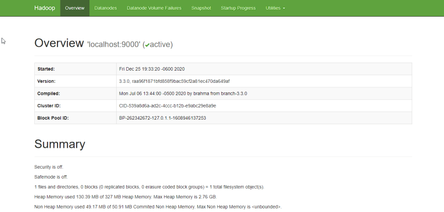
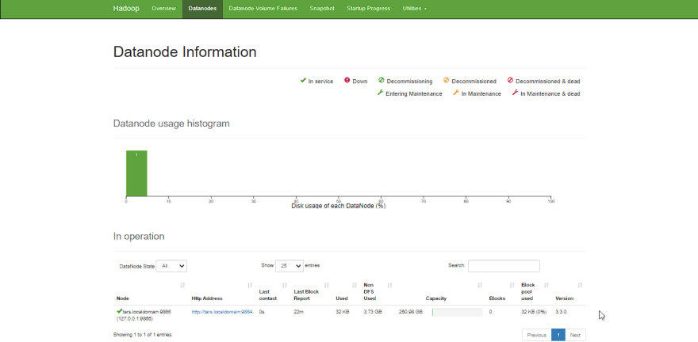
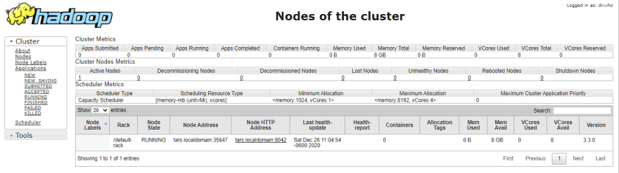

This article provides a step-by-step guide to install **Hadoop** on Windows 10 via WSL (Windows Subsystem for Linux). These instructions are also applicable for installing Hadoop on Linux systems.

## Prerequisites

Follow the steps mentioned on the page below to first enable Windows Subsystem for Linux and then install a Linux distribution of your choice.

[Windows Subsystem for Linux(WSL) installation Guide for Windows 10](https://docs.microsoft.com/en-us/windows/wsl/install-win10#manual-installation-steps)

## Configure passphraseless ssh

Hadoop require SSH access to manage its nodes.

**_This is a critical step and please make sure you follow the steps_**

Make sure you can SSH to localhost in Ubuntu:

```shell
ssh localhost
```

If you encounter the error `ssh: connet to host localhost 22: Connection refused`, run the following commants:

```shell
sudo apt remove openssh-server
sudo apt install openssh-server
sudo service ssh start
```

If you cannot ssh to localhost without a passphrase, run the following command to initialize your private and public keys:

```shell
ssh-keygen -t rsa -P '' -f ~/.ssh/id_rsa
cat ~/.ssh/id_rsa.pub >> ~/.ssh/authorized_keys
chmod 0600 ~/.ssh/authorized_keys
```

Now `ssh localhost` should work without any passphrase.

## Hadoop Installation

---

## Install Java JDK

Update the package index:

```shell
sudo apt update
```

Check whether Java is already installed:

```shell
java -version
```

If Java isn't installed, install Java 8 from OpenJDK via the following command:

```shell
sudo apt-get install openjdk-8-jdk
```

Check the version installed:

```shell
java -version
openjdk version "1.8.0_275"
OpenJDK Runtime Environment (build 1.8.0_275-8u275-b01-0ubuntu1~20.04-b01)
OpenJDK 64-Bit Server VM (build 25.275-b01, mixed mode)
```

## Download Hadoop binary

Visit the hadoop releases page to find the a download URL for Hadoop **_(I'm using Hadoop 3.3.0)_** : [Hadoop Releases](https://hadoop.apache.org/releases.html)

Run the following command to download the latest binary for Hadoop 3.3.0:

```shell
wget https://downloads.apache.org/hadoop/common/hadoop-3.3.0/hadoop-3.3.0.tar.gz
```

Wait until the download is completed.

## Unzip Hadoop Binary

Create a `hadoop` folder under the user home folder:

```shell
mkdir ~/hadoop
```

Unzip the downloaded binary package:

```shell
tar -xvzf hadoop-3.3.0.tar.gz -C ~/hadoop
```

After the package is unzipped, change the current directory to the Hadoop folder:

```shell
cd ~/hadoop/hadoop-3.3.0/
```

## Setup environment variables

```shell
nano ~/.bashrc
```

Setup Hadoop and Java environment variables at the end of the `.bashrc` file as below and then save the bash file and close it.

```shell
#Set Hadoop-related environment variables
export JAVA_HOME=/usr/lib/jvm/java-8-openjdk-amd64
export HADOOP_HOME=~/hadoop/hadoop-3.3.0
export PATH=$PATH:$HADOOP_HOME/bin
export PATH=$PATH:$HADOOP_HOME/sbin
export HADOOP_CONF_DIR=$HADOOP_HOME/etc/hadoop
export HADOOP_MAPRED_HOME=$HADOOP_HOME
export HADOOP_COMMON_HOME=$HADOOP_HOME
export HADOOP_HDFS_HOME=$HADOOP_HOME
export YARN_HOME=$HADOOP_HOME
```

For applying all these changes to the current Terminal, execute the source command.

```shell
source ~/.bashrc
```

Make sure that Java and Hadoop have been properly installed on your system and can be accessed through the Terminal by:

```shell
java -version
openjdk version "1.8.0_275"
OpenJDK Runtime Environment (build 1.8.0_275-8u275-b01-0ubuntu1~20.04-b01)
OpenJDK 64-Bit Server VM (build 25.275-b01, mixed mode)
```

```shell
hadoop version
Hadoop 3.3.0
Source code repository https://gitbox.apache.org/repos/asf/hadoop.git -r aa96f1871bfd858f9bac59cf2a81ec470da649af
Compiled by brahma on 2020-07-06T18:44Z
Compiled with protoc 3.7.1
From source with checksum 5dc29b802d6ccd77b262ef9d04d19c4
This command was run using /home/daftdey/hadoop/hadoop-3.3.0/share/hadoop/common/hadoop-common-3.3.0.jar
```

## Configure the pseudo-distributed mode (Single Node mode)

This page below is the official documentation to configure a single node cluster:

[Pseudo-Distributed Operations](https://hadoop.apache.org/docs/r3.3.0/hadoop-project-dist/hadoop-common/SingleCluster.html#Pseudo-Distributed_OperationPseudo-Distributed_Operation)

All the Hadoop configuration files should be located in the `~/hadoop/hadoop-3.3.0/etc/hadoop` directory.

```shell
cd ~/hadoop/hadoop-3.3.0/etc/hadoop
```

**The configuration setup steps are as follows:**

1. Edit file `hadoop-env.sh`:

   ```shell
   nano hadoop-env.sh
   ```

   Set Java environment variable as,

   ```shell
   export JAVA_HOME=/usr/lib/jvm/java-8-openjdk-amd64
   ```

2. Edit file `core-site.xml`
   `core-site.xml` informs the Hadoop daemon where NameNode runs in the cluster. It contains configuration settings of Hadoop core such as I/O settings that are common to HDFS & MapReduce.

   ```shell
   nano core-site.xml
   ```

   Add the following configuration:

   ```xml
   <configuration>
     <property>
       <name>fs.defaultFS</name>
       <value>hdfs://localhost:9000</value>
     </property>
   </configuration>
   ```

3. Edit file `hdfs-site.xml`:
   `hdfs-site.xml` contains configuration settings of HDFS daemons (i.e. NameNode, DataNode, Secondary NameNode). It also includes the replication factor and block size of HDFS.

   ```shell
   nano hdfs-site.xml
   ```

   Add the following configuration:

   ```xml
   <configuration>
     <property>
       <name>dfs.replication</name>
       <value>1</value>
     </property>
   </configuration>
   ```

4. Edit file `mapred-site.xml`
   `mapred-site.xml` contains configuration settings of MapReduce application like the number of JVM that can run in parallel, the size of the mapper and the reducer process, CPU cores available for a process, etc.

   ```shell
   nano mapred-site.xml
   ```

   Add the following configuration:

   ```xml
   <configuration>
    <property>
        <name>mapreduce.framework.name</name>
        <value>yarn</value>
    </property>
    <property>
        <name>mapreduce.application.classpath</name>
        <value>$HADOOP_MAPRED_HOME/share/hadoop/mapreduce/*:$HADOOP_MAPRED_HOME/share/hadoop/mapreduce/lib/*</value>
    </property>
   </configuration>
   ```

5. Edit file `yarn-site.xml`:
   `yarn-site.xml` contains configuration settings of ResourceManager and NodeManager like application memory management size, the operation needed on program & algorithm, etc.

   ```shell
   nano yarn-site.xml
   ```

   Add the following configuration:

   ```xml
   <configuration>
    <property>
        <name>yarn.nodemanager.aux-services</name>
        <value>mapreduce_shuffle</value>
    </property>
    <property>
        <name>yarn.nodemanager.env-whitelist</name>
        <value>JAVA_HOME,HADOOP_COMMON_HOME,HADOOP_HDFS_HOME,HADOOP_CONF_DIR,CLASSPATH_PREPEND_DISTCACHE,HADOOP_YARN_HOME,HADOOP_MAPRED_HOME</value>
    </property>
   </configuration>
   ```

## Format namenode

Go to the hadoop home directory and format the Hadoop namenode:

```shell
cd ~/hadoop/hadoop-3.3.0
bin/hdfs namenode -format
```

This formats the HDFS via the NameNode. Formatting the file system means initializing the directory specified by the `dfs.name.dir` variable.

**_This command should be executed only for the first time. Never format an up and running Hadoop filesystem. You will lose all your data stored in the HDFS._**

## Run HDFS daemons

The _NameNode_ is the centerpiece of an HDFS file system. It keeps the directory tree of all files stored in the HDFS and tracks all the files stored across the cluster.

On startup, a _DataNode_ connects to the _Namenode_ and it responds to the requests from the _Namenode_ for different operations.

## Start NameNode daemon and DataNode daemon

```shell
sbin/start-dfs.sh
Starting namenodes on [localhost]
Starting datanodes
Starting secondary namenodes [tars]
```

Check status via `jps` command

```shell
jps
8544 SecondaryNameNode
8304 DataNode
8149 NameNode
8702 Jps
```

When the HDFS services are successfully initiated, you should be able to see these four processes running.

## View **Namenode** portal

Now open the browser and go to the following URL to view the NameNode interface. Scroll down and see the number of live nodes.

[http://localhost:9870/dfshealth.html#tab-overview](http://localhost:9870/dfshealth.html#tab-overview)

The web UI looks like this:



Data nodes information can be also viewed through the Datanodes menu link:



## Run YARN daemon

---

_ResourceManager_ is the master that arbitrates all the available cluster resources and thus helps in managing the distributed applications running on the YARN system. Its work is to manage each _NodeManagers_ and each application’s ApplicationMaster.

The _NodeManager_ in each machine framework is the agent that is responsible for managing containers, monitoring their resource usage, and reporting the same to the _ResourceManager_.

## Start ResourceManager daemon and NodeManager daemon

```shell
sbin/start-yarn.sh
Starting resourcemanager
Starting nodemanagers
```

Check status using the `jps` command

```shell
jps
11831 ResourceManager
11352 DataNode
12347 Jps
11196 NameNode
11981 NodeManager
11597 SecondaryNameNode
```

Once the YARN services are started, two more processes for NodeManager and ResourceManage can be seen running.

## View YARN web portal

Now open the browser and go to the following URL to view the YARN resource manager web UI.

[http://localhost:8088/cluster](http://localhost:8088/cluster)

The web UI looks like this:



Execution of all the Hadoop applications can be monitored through this web portal.

## Shutdown Hadoop services

After completion of the execution of all Hadoop applications, the HDFS and YARN services can be stopped as follows:

```shell
sbin/stop-yarn.sh
sbin/stop-dfs.sh
```

Verify status via `jps` command, only the jps service should be running:

```shell
jps
13257 Jps
```

## Summary

Congratulations, you have successfully installed a single-node Hadoop cluster in one go on your Linux subsystem of Windows 10. It’s relatively easier compared to installing on Windows as we don’t need to download or build native Hadoop HDFS libraries.

**Have fun exploring with Hadoop.**

If you encounter any issues while following the steps, please post a comment and I will try my best to help.

---

## Further Reference

- [Apache Hadoop/Documentation](https://hadoop.apache.org/docs/current/)

- [Windows Subsystem for Linux Installation Guide for Windows 10](https://docs.microsoft.com/en-us/windows/wsl/install-win10)
